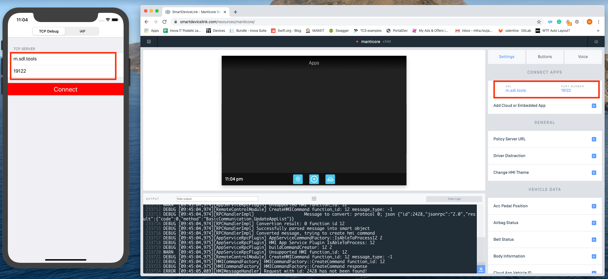
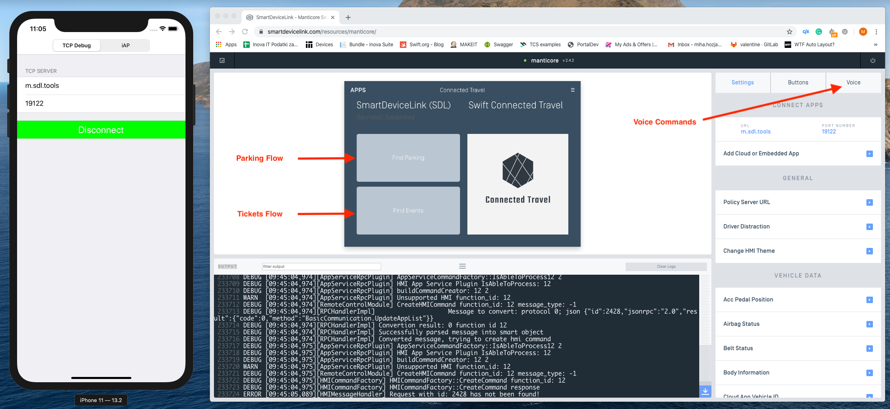

# Demo SDL application

This repository contains the SDL’s demo application which was slightly refactored to show some of the possible features which could improve user's every day driving experience.

Features of the app:

* using Parkwhiz API to request and show available parking spots
* enables a user to book a parking
* using Ticket Master API to request and show upcoming events
* voice support, with phrases like *"Find parking"* and *"Find events"*

## Documentation

* The SDK for iOS and Android: [Smart Device Link SDK](https://smartdevicelink.com/docs/)
* Testing platform: [Manticore](https://smartdevicelink.com/resources/manticore/)
* Official sample app: [App](https://github.com/smartdevicelink/sdl_ios/tree/master/Example%20Apps)
* APIs: [Ticketmaster](https://developer.ticketmaster.com)

## Instructions

* Go to the `connectedtravel` folder
* Install cocoapods by running `pod install`
* Open project's workspace
* Setup signing information (set your team or personal account,...)
* In 'connectedtravel/utils/APIManager.swift' enter your ticket master api key
* Run the app
* Connect to the Manticore by entering the URL and port provided by Manticore

* Start using the app

